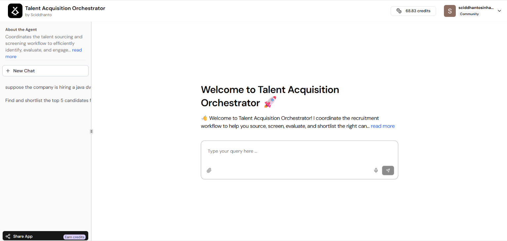

# 🤖 Talent Acquisition Orchestrator

An AI-powered recruitment assistant built using **Lyzr Agent Studio** to support different stages of the talent acquisition workflow, including job requirement analysis, resume screening, candidate evaluation, ranking, shortlisting, and candidate outreach.


## 📌 Project Overview

Recruitment involves several repetitive and time-consuming activities, such as understanding job requirements, reviewing candidate resumes, comparing skills and experience, ranking candidates, and preparing outreach messages.

The **Talent Acquisition Orchestrator** is designed as an AI-powered recruitment assistant that helps support these activities through natural-language interaction.

The objective of the project is to make the recruitment workflow more structured and efficient while ensuring that final hiring decisions remain with human recruiters.

> ⚠️ This AI agent is designed to assist recruiters and does not independently make final hiring decisions.


## 🎯 Problem Statement

Recruiters often need to manually:

- Analyze job descriptions.
- Review multiple candidate resumes.
- Compare candidate skills with job requirements.
- Identify skill and experience gaps.
- Evaluate candidate suitability.
- Rank candidates.
- Create shortlists.
- Prepare candidate outreach messages.

When dealing with multiple applicants, these activities can become repetitive and time-consuming.

The Talent Acquisition Orchestrator uses AI to assist recruiters with these tasks and provide structured recruitment insights.


## 💡 Solution

The **Talent Acquisition Orchestrator** acts as a centralized AI-powered recruitment assistant.

The agent can support:

- 📋 Job Requirement Analysis
- 🔍 Candidate Identification
- 📄 Resume Screening
- 🧠 Candidate Evaluation
- 📊 Candidate Ranking
- ⭐ Candidate Shortlisting
- ✉️ Candidate Outreach

Recruiters can interact with the agent using natural-language prompts.


# 🤖 Agent Architecture

This project is implemented as a **Single-Agent AI System**.

One main AI agent, the **Talent Acquisition Orchestrator**, handles multiple recruitment-related tasks based on the user's request.

```text
                    USER / RECRUITER
                           │
                           ▼
            TALENT ACQUISITION ORCHESTRATOR
                     Single AI Agent
                           │
          ┌────────────────┼────────────────┐
          ▼                ▼                ▼
   Job Requirement     Resume           Candidate
      Analysis         Screening        Evaluation
          │                │                │
          └────────────────┼────────────────┘
                           ▼
                    Candidate Ranking
                           │
                           ▼
                    Candidate Shortlisting
                           │
                           ▼
                    Candidate Outreach
                           │
                           ▼
                    HUMAN REVIEW
```


# 🔄 Recruitment Workflow

```text
Job Description
       │
       ▼
Job Requirement Analysis
       │
       ▼
Candidate Resumes
       │
       ▼
Resume Screening
       │
       ▼
Candidate Evaluation
       │
       ▼
Candidate Ranking
       │
       ▼
Candidate Shortlisting
       │
       ▼
Candidate Outreach
       │
       ▼
Human Recruiter Review
```


# 🧪 Demonstration Scenario

For demonstration purposes, the project uses:

- **1 Job Description**
- **5 Candidate Resumes**

## Example Position

**Software Developer**

### Job Requirements

- Java
- Spring Boot
- SQL
- REST APIs
- Minimum 2 years of experience
- Bachelor's degree in Computer Science, IT, or a related field


## 👥 Example Candidate Profiles

| Candidate | Skills and Experience | Expected Match |
|---|---|---|
| Candidate A | Java, Spring Boot, SQL, REST APIs, 3 years | 🟢 Strong Match |
| Candidate B | Java, Spring Boot, SQL, 2.5 years | 🟢 Strong Match |
| Candidate C | Java, SQL, REST APIs, 2 years | 🟡 Partial Match |
| Candidate D | Python, Django, 3 years | 🔴 Weak Match |
| Candidate E | Java, Spring Boot, REST APIs, 1 year | 🟡 Partial Match |


# ⚙️ Agent Workflow and Examples

## 1️⃣ Job Requirement Analysis

### Purpose

The agent first analyzes the job description and identifies the important requirements.

### Example Input

```text
Analyze the following job requirements for a Software Developer position:

Required Skills:
- Java
- Spring Boot
- SQL
- REST APIs

Experience:
- Minimum 2 years
```

### What the Agent Does

The agent extracts the role, required skills, experience requirements, and other relevant criteria.

### Example Output

```text
Role: Software Developer

Required Skills:
- Java
- Spring Boot
- SQL
- REST APIs

Minimum Experience:
- 2 years
```


## 2️⃣ Candidate Identification

### Purpose

Based on the job requirements, the agent identifies candidates who appear relevant to the position.

### Example Input

```text
Identify candidates who are potentially suitable for the Software Developer position.
```

### Example Output

```text
Candidate A → Strong potential match
Candidate B → Strong potential match
Candidate C → Potential match
Candidate D → Weak match
Candidate E → Potential match
```


## 3️⃣ Resume Screening

### Purpose

The agent compares candidate resumes against the required skills and experience.

### Example Input

```text
Screen these five candidates against the Software Developer job requirements.
```

### Example Output

| Candidate | Result | Reason |
|---|---|---|
| Candidate A | 🟢 Strong Match | Meets all major requirements |
| Candidate B | 🟢 Strong Match | Meets most major requirements |
| Candidate C | 🟡 Partial Match | Missing Spring Boot |
| Candidate D | 🔴 Weak Match | Primary experience is Python and Django |
| Candidate E | 🟡 Partial Match | Only 1 year of experience |


## 4️⃣ Candidate Evaluation

### Purpose

The agent evaluates candidates and identifies their strengths and potential gaps.

### Example

### Candidate A

**Strengths:**

- Java
- Spring Boot
- SQL
- REST APIs
- 3 years of relevant experience

**Potential Gaps:**

- No major gap identified based on the provided requirements.

### Candidate C

**Strengths:**

- Java
- SQL
- REST APIs
- Meets minimum experience requirements

**Potential Gap:**

- Spring Boot experience is not identified.


## 5️⃣ Candidate Ranking

### Purpose

The agent compares candidates and ranks them based on their overall alignment with the job requirements.

### Example Input

```text
Rank the five candidates from strongest to weakest based on their suitability for the Software Developer position.
```

### Example Output

```text
1. Candidate A — High Match
2. Candidate B — High Match
3. Candidate C — Medium Match
4. Candidate E — Medium Match
5. Candidate D — Low Match
```

The ranking should be based on job-relevant factors such as skills and relevant experience.


## 6️⃣ Candidate Shortlisting

### Purpose

The agent recommends the strongest candidates based on the screening, evaluation, and ranking.

### Example Input

```text
Shortlist the top 3 candidates and explain the reasoning.
```

### Example Output

```text
SHORTLISTED CANDIDATES

1. Candidate A
2. Candidate B
3. Candidate C
```

### Reasoning

- **Candidate A:** Strong alignment with all major technical requirements and relevant experience.
- **Candidate B:** Strong technical background and sufficient experience.
- **Candidate C:** Relevant Java, SQL, and REST API skills but lacks Spring Boot experience.

> The shortlist is an AI-generated recommendation and should be reviewed by a human recruiter.


## 7️⃣ Candidate Outreach

### Purpose

The agent can assist recruiters in preparing professional outreach messages.

### Example Input

```text
Create a professional outreach message for Candidate A regarding the Software Developer position.
```

### Example Output

```text
Subject: Software Developer Opportunity

Hi Candidate A,

We came across your experience in Java and Spring Boot and believe that
your background could be relevant to a Software Developer opportunity.

Your experience with Java, Spring Boot, SQL, and REST APIs aligns with
several requirements of the position.

We would be happy to discuss the opportunity with you.

Best regards,
Recruitment Team
```

The recruiter can review and personalize the message before sending it.


# 💬 Example Prompts

Users can interact with the agent using prompts such as:

```text
Analyze the job requirements for this position.
```

```text
Screen these candidate resumes against the job requirements.
```

```text
Identify the strengths and skill gaps of each candidate.
```

```text
Compare and rank these candidates based on job fit.
```

```text
Shortlist the top 3 candidates and explain why.
```

```text
Generate an outreach message for the shortlisted candidate.
```


# 🛠️ Technologies and Concepts Used

- **Lyzr Agent Studio**
- **Artificial Intelligence**
- **Generative AI**
- **Large Language Models (LLMs)**
- **Prompt Engineering**
- **Document Processing**
- **PDF Support**
- **Knowledge Retrieval**
- **Conversational Memory**
- **Responsible AI**


# 📄 Document and PDF Support

Candidate resumes are often available in PDF format.

The agent can work with document-based information as part of the recruitment workflow.

For example:

```text
Candidate Resume (PDF)
          │
          ▼
    AI Document Analysis
          │
          ▼
Extract Skills and Experience
          │
          ▼
Compare with Job Requirements
          │
          ▼
Generate Recruitment Insights
```


# 🧠 Conversational Memory

Memory can help maintain context during an interaction.

### Example

First, the recruiter asks:

```text
Screen these five candidates.
```

Then the recruiter asks:

```text
Now rank the top three candidates.
```

The agent can understand that the second request refers to the candidates discussed previously.

This creates a more natural conversational experience.


# ⚖️ Responsible AI

Responsible AI is particularly important in recruitment because AI-generated recommendations can influence decisions involving people.

Important considerations include:

- Evaluate candidates based on job-related criteria.
- Avoid using irrelevant personal characteristics.
- Provide structured reasoning for recommendations where possible.
- Do not treat AI recommendations as final hiring decisions.
- Keep human recruiters involved in the decision-making process.
- Protect candidate information and privacy.

> **The AI assists with recruitment tasks, while the final hiring decision remains with humans.**


# 🎯 Key Benefits

The Talent Acquisition Orchestrator can help provide:

- ⏱️ Faster initial resume screening
- 📄 Reduced repetitive work
- 🔍 Structured candidate evaluation
- 📊 Easier candidate comparison
- ⭐ Faster shortlisting
- ✉️ Assistance with outreach preparation
- 🧠 Natural-language interaction with recruitment information


# 🔮 Future Enhancements

Possible future improvements include:

- Applicant Tracking System (ATS) integration
- Candidate database integration
- Automated interview scheduling
- Email integration
- Candidate status tracking
- Recruitment analytics
- Interview feedback analysis
- Advanced document processing
- Multi-agent recruitment architecture

A future multi-agent architecture could include:

```text
                   Recruitment Orchestrator
                            │
        ┌───────────────────┼───────────────────┐
        ▼                   ▼                   ▼
   Sourcing Agent     Screening Agent      Ranking Agent
        │                   │                   │
        └───────────────────┼───────────────────┘
                            ▼
                     Outreach Agent
```


# 📸 Screenshots

Screenshots of the project can be added to the repository.

Suggested screenshots:

- Agent welcome screen
- Agent configuration
- Example prompts
- Resume screening demonstration
- Candidate ranking demonstration
- Candidate shortlisting demonstration

### Talent Acquisition Orchestrator Interface




# 📁 Repository Structure

```text
talent-acquisition-orchestrator/
│
├── README.md
│
├── screenshots/
│   ├── agent-configuration.png
│   ├── agent-interface.png
│   ├── resume-screening-demo.png
│   ├── candidate-ranking-demo.png
│   └── candidate-shortlisting-demo.png
│
└── docs/
    └── project-workflow.md
```


# 👨‍💻 Author

**Sciddhanto Sinha**

Aspiring AI and Intelligent Automation Professional


# ⭐ Project Summary

The **Talent Acquisition Orchestrator** is a **single-agent AI recruitment assistant** developed using **Lyzr Agent Studio**.

It supports multiple stages of the recruitment workflow:

```text
Job Requirements
       ↓
Candidate Identification
       ↓
Resume Screening
       ↓
Candidate Evaluation
       ↓
Candidate Ranking
       ↓
Candidate Shortlisting
       ↓
Candidate Outreach
       ↓
Human Recruiter Review
```

The primary objective of the project is to reduce repetitive recruitment activities and provide structured AI-assisted insights while ensuring that **human recruiters retain control over final hiring decisions**.
